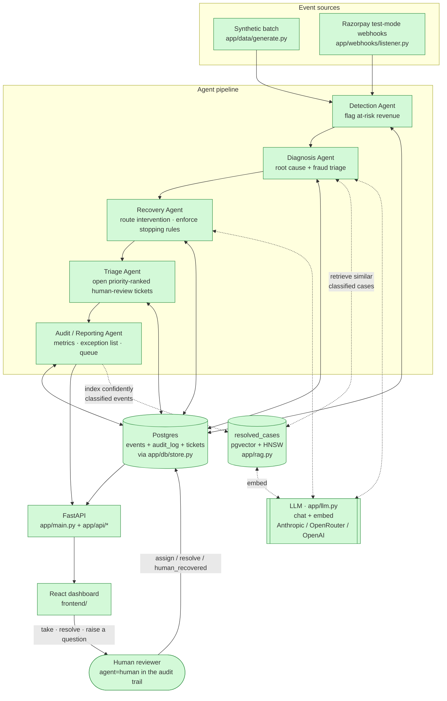
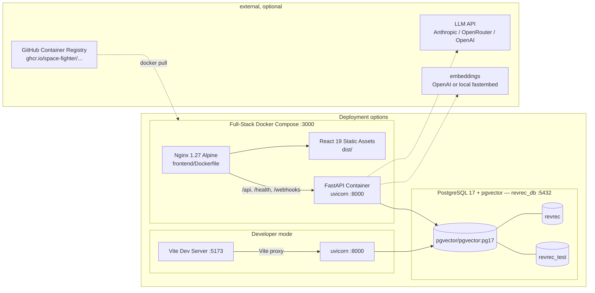
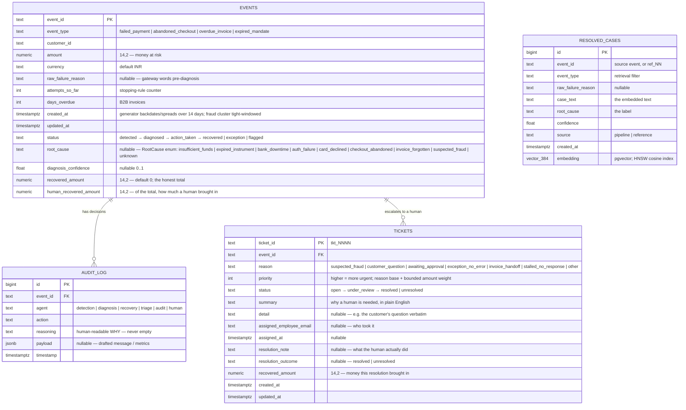
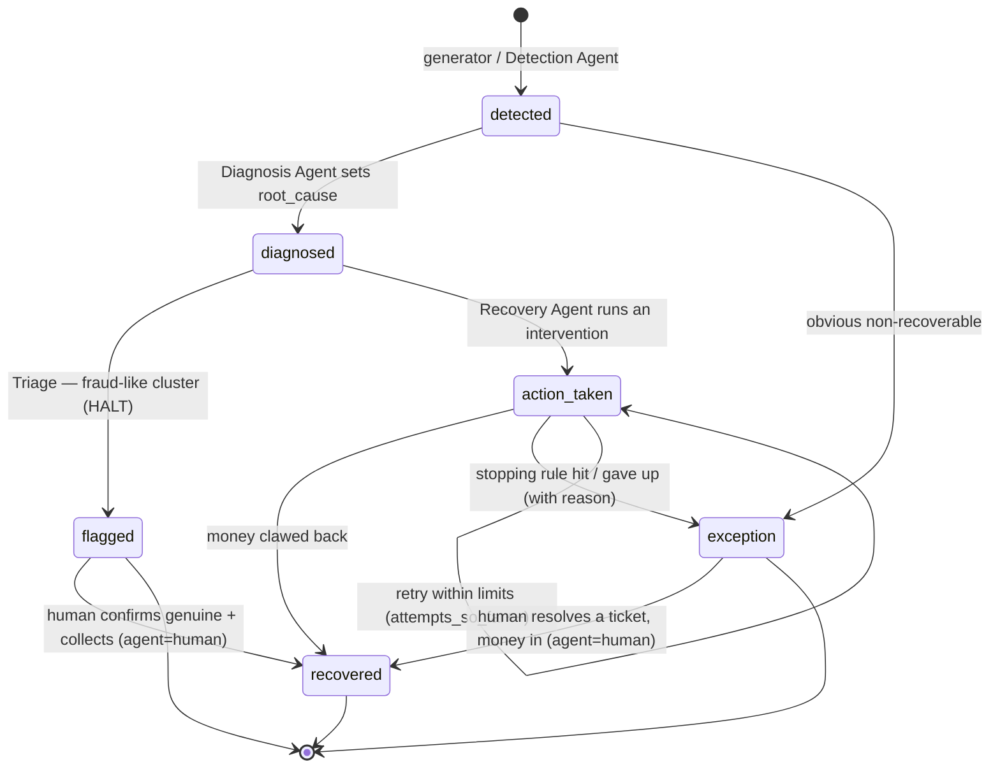
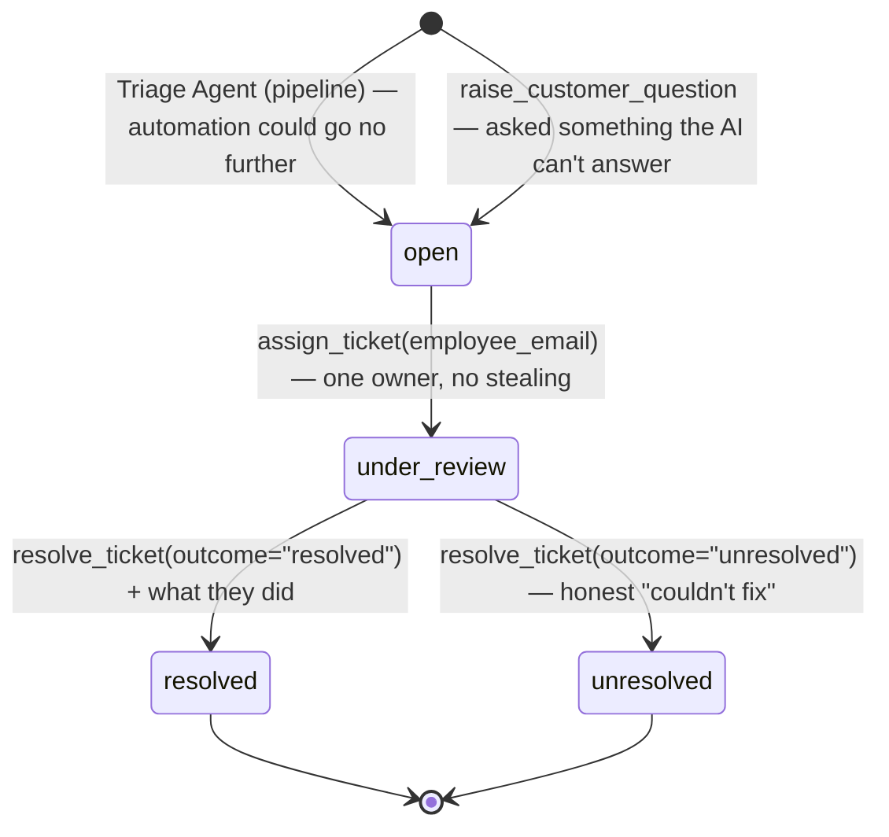
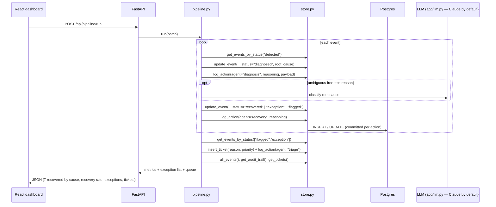
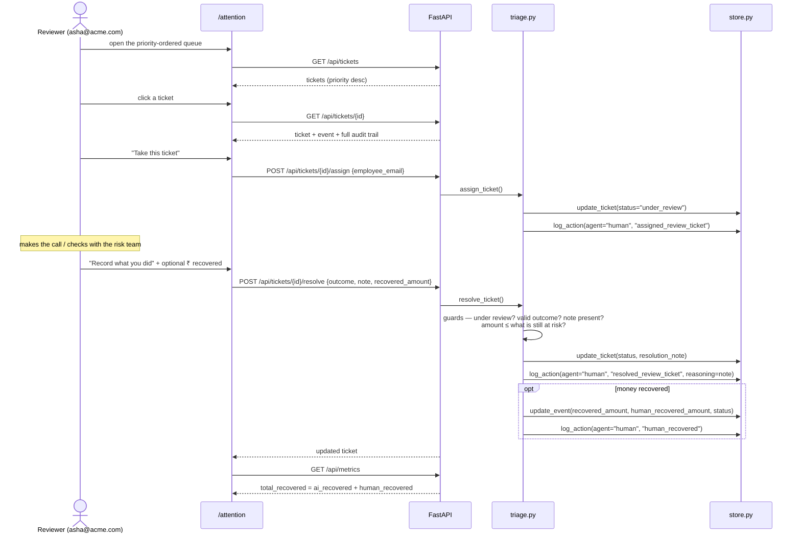

# Architecture — AI Revenue Recovery

Diagrams and design rationale. Companion to
[documentation.md](documentation.md) (exhaustive file/function reference) and
[CLAUDE.md](CLAUDE.md) (project brief).

> **Keep this current.** CLAUDE.md Section 13 requires this file to be updated in
> the same change that alters the architecture, data model, agent flow, or
> runtime topology.

Last updated: 2026-09-04 — **Urgent human attention**: a `tickets` table +
Triage agent (`app/agents/triage.py`) between Recovery and Audit, a
priority-ordered review queue with a take → record-what-you-did → resolved /
unresolved lifecycle, `agent="human"` audit rows, and AI-vs-human recovered-money
attribution (`Event.human_recovered_amount`). New §5.1 (ticket lifecycle) and
§6.1 (a human working the queue); §2 / §4 / §5 / §7 / §8 updated. Turns plan.md
§6's audit-log-only human-approval flag into the real workflow it says to build
when not short on time.
Prior: 2026-09-04 — Direction 6 spoken playback: Sarvam AI (`bulbul`) neural
TTS for the Hinglish Voice Recovery Agent (`app/agents/voice_tts.py`, `GET
/api/events/{id}/voice/audio`); `VoiceCallDrawer` plays per-turn Sarvam WAV clips
and degrades to the browser `SpeechSynthesis` voice when `SARVAM_API_KEY` is unset
or the provider errors.
Prior: 2026-09-04 — Extended Capabilities: Direction 5 (Mandate Retry Sequencer: `app/agents/sequencer.py`),
Direction 6 (Hinglish Voice Recovery Agent: `app/agents/voice.py` + `VoiceCallDrawer`), Direction 7 (Promise-to-Pay Tracker: `app/agents/ptp.py` + `PTPModal`).
Prior: 2026-09-04 — Multi-stage Docker containerization & GitHub Actions CD
(`.github/workflows/cd.yml` → GHCR image registry; `backend/Dockerfile` + `frontend/Dockerfile` + `nginx.conf` + full-stack `docker-compose.yml`).
Prior: 2026-09-04 — Razorpay test-mode webhook listener
(`app/webhooks/listener.py`, `POST /webhooks/razorpay`) as a second event
source into Detection; pipeline diagram node `WH` → done. Prior: 2026-09-04 —
RAG knowledge base (`app/rag.py`: pgvector
`resolved_cases` + HNSW, wired into Diagnosis; embeddings via `app/llm.embed`);
Postgres moved to the `pgvector/pgvector` Docker container (Docker + WSL2 work
here — the earlier note was wrong). Prior: 2026-09-04 — provider-agnostic LLM
client (`app/llm.py`: Anthropic / OpenRouter / OpenAI, auto-detected). Prior:
2026-09-04 — Phase B + C of the agent-team build (plan.md §9 steps 3–8): all four agents built + merged,
`app/pipeline.py` chains them, `app/api/*` routers mounted in `main.py`, React
dashboard built, pipeline nodes recoloured `done`. Prior: 2026-09-03 — Phase A
(RootCause vocabulary, cross-agent + API contract frozen). Prior: 2026-08-28 —
step 2 (synthetic data generator); datastore switched from Docker to a local
PostgreSQL process.

---

## 1. One-paragraph summary

Synthetic (and later, real Razorpay test-mode webhook) events flow through
sequential agents — **Detection → Diagnosis → Recovery → Triage → Audit** — that
all read and write one shared Postgres store via `app/db/store.py`. Every
money-related decision is written to the `audit_log` table *as it happens*; that
table **is** the audit trail. Recovery is root-cause-differentiated and bounded
by explicit stopping rules; a fraud-like cluster is deliberately re-classified as
`flagged` and left alone. Where the automation stops, **Triage** opens a
priority-ordered human-review ticket, and a person's own actions — taking a
ticket, recording what they did, recovering money themselves — are written to the
same audit trail as `agent="human"`. A FastAPI backend exposes the store and the
pipeline over REST; a React dashboard renders the at-risk queue, per-case
decision trails, recovery metrics, an honest exception list, and the urgent
human-attention queue.

---

## 2. Agent pipeline

Both event sources feed the same store: the synthetic generator seeds a batch;
`app/webhooks/listener.py` ingests **signed Razorpay test-mode** webhook
deliveries (`payment.failed`, `payment_link.expired`, `invoice.expired`,
`subscription.halted`) as `detected` events. The pipeline is source-agnostic —
it only ever reads `status` from the store.

Dashed = optional/degrading edges: the LLM and the RAG knowledge base are used
when configured and are no-ops otherwise (Diagnosis falls back to its rules
classifier). `app/rag.py` retrieves the nearest already-classified cases from
`resolved_cases` (pgvector HNSW) as few-shot examples **before** the Diagnosis
LLM call; `pipeline.run` grows that knowledge base after each run (curated:
dedup + per-bucket cap).

**Triage** runs once every event is terminal. It opens exactly one review ticket
per case the automation could not carry further, scores it so the queue is
priority-ordered (suspected fraud ≫ a retry that merely ran out of attempts), and
never reopens a ticket a person has closed. The human's loop back into the store
is a real edge, not a diagram flourish: taking a ticket, closing it with a note,
and recording money they recovered each write an `agent="human"` audit row, and
human-recovered money is tracked separately from what the agents collected.

Green = built. `app/pipeline.py` chains DET→DIA→REC→TRI→AUD; `app/api/*`
exposes the store + pipeline + review queue over REST; the React dashboard
renders it.

---

## 3. Runtime topology

---

## 4. Data model

`RESOLVED_CASES` is the RAG knowledge base (`app/rag.py`). It has **no FK** to
`EVENTS` — rows outlive individual batches and reference cases have no event.
Created only when the target Postgres has the `vector` extension.

---

## 5. Event lifecycle

`recovered` / `exception` / `flagged` are terminal **for the automation**.
`exception` = honest "couldn't recover, here's why"; `flagged` = deliberately
stopped (suspected abuse), never retried by an agent. The only way out of a
terminal state is a **person** closing a review ticket having actually collected
the outstanding money — an audited, attributed override, never an automated one.

### 5.1 Human-review ticket lifecycle

Closed is closed: a later pipeline run never reopens or duplicates a ticket a
person has already dealt with. Every transition writes an `agent="human"` audit
row, and the reviewer's own note becomes that row's `reasoning` verbatim — so
the case trail reads as one story from first detection to the person who
finished it.

---

## 6. Request / data flow (target, once API + agents exist)

### 6.1 A human working the queue

---

## 7. Component responsibilities

| Component | File(s) | Responsibility | Must guarantee |
|---|---|---|---|
| Event store | `app/db/store.py` | single interface to Postgres; table + schema models; CRUD + audit | no raw SQL elsewhere; `log_action` is the only audit write; FK-checked; validated input |
| Synthetic generator | `app/data/generate.py` | deterministic 50–100 event batch + fraud cluster; real Razorpay failure codes | reproducible per seed; every record schema-valid; fraud cluster has a detectable shared signature |
| Detection Agent | `app/agents/detection.py` ✅ | flag genuinely at-risk events; route obvious non-recoverables to `exception` | one audit row per decision; idempotent |
| Diagnosis Agent | `app/agents/diagnosis.py` ✅ | rules-first root-cause classification; **RAG-then-LLM** fallback for free-text (retrieve similar past cases → few-shot the LLM); **fraud-cluster triage → `flagged`** | confidence recorded; triage reasoning explicit; RAG + LLM isolated + offline-safe |
| RAG knowledge base | `app/rag.py` + `store.resolved_cases` ✅ | embed a case, retrieve nearest classified cases (pgvector HNSW); grow the KB after each run (curated, bounded) | no-op without pgvector / embeddings; the only vector search is `store.nearest_resolved_cases` |
| LLM client | `app/llm.py` ✅ | `chat()` + `embed()`, provider auto-detected | never raises; deterministic fallback when unconfigured |
| Recovery Agent | `app/agents/recovery.py` ✅ | root-cause-specific intervention; draft outreach; **enforce stopping rules** (max attempts, max escalation, cooldown, amount gate) | bounded; never reads `flagged`; human-approval flag above ₹5,000 (logged, not executed); deterministic outcome |
| Mandate Retry Sequencer | `app/agents/sequencer.py` ✅ | intelligent multi-step mandate & subscription retry schedule (Direction 5) | rail-aware (UPI AutoPay / e-NACH / Card Token), calendar & salary cycle optimized, NPCI 3-attempt limit |
| Hinglish Voice Recovery | `app/agents/voice.py` ✅ | conversational multi-turn phone call scripts & WhatsApp copy in natural Hinglish (Direction 6) | natural code-switching, empathetic tone, offline deterministic fallback scripts |
| Hinglish Voice TTS | `app/agents/voice_tts.py` ✅ | synthesize each dialogue turn via Sarvam AI `bulbul` (agent vs customer speaker), return base64 WAV clips | optional (needs `SARVAM_API_KEY`); never raises — degrades to `available:false` so the dashboard uses the browser voice |
| Triage Agent | `app/agents/triage.py` ✅ | open one priority-scored review ticket per case the automation could not finish; carry the three human actions (take / resolve / raise a customer question) | idempotent — never duplicates or reopens a closed ticket; every human action writes an `agent="human"` audit row; resolution money bounded by what is still at risk |
| Promise-to-Pay (PTP) Tracker | `app/agents/ptp.py` ✅ | commitment state machine: pause escalation, track honor/breakage, metrics (Direction 7) | pauses automated contact during commitment window; records fulfillment & breakage to audit trail |
| Audit / Reporting | `app/agents/audit.py` ✅ | `compute_metrics` rolls `audit_log` + `events` into the MetricsBlock; `run` writes one `batch_metrics` row | computed over the full batch; exception list complete, never hidden; includes PTP metrics |
| Pipeline | `app/pipeline.py` ✅ | chains agents 3–6 into one run; returns the MetricsBlock | argparse CLI + printed summary |
| API | `app/main.py`, `app/api/*` ✅ | REST over store + pipeline (`/api/events`, `/api/events/{id}/audit`, `/api/metrics`, `/api/pipeline/run`) | CORS to frontend only |
| Dashboard | `frontend/src/pages/*` ✅ (fixtures; live via `VITE_DATA_SOURCE`) | at-risk queue, decision trail, charts, exception list, fraud-cluster alert | mirrors Razorpay's plain-English tone |
| Webhook listener | `app/webhooks/listener.py` ✅ | ingest Razorpay **test-mode** webhook deliveries as `detected` events | HMAC-SHA256 signature verified over the raw body; idempotent (dedup by event id); success/unknown events acknowledged but ignored; amounts paise→₹; no PII stored (emails/phones hashed) |

---

## 8. Key design decisions

| Decision | Choice | Why |
|---|---|---|
| Datastore | PostgreSQL 17 via the `pgvector/pgvector:pg17` **Docker container** (`docker compose up -d`) | real types (`NUMERIC`, `TIMESTAMPTZ`, `JSONB`, `vector`); FK always on; pgvector native for the RAG layer. Docker Desktop + WSL2 work here — an earlier note claiming otherwise was wrong. `scripts/pg.ps1` (embedded binary, no extensions) kept as a no-Docker fallback with RAG disabled |
| ORM / validation | SQLModel (SQLAlchemy 2 + Pydantic) | one model stack for tables *and* API request/response shapes |
| Validation split | thin table models + `*Create` / `*Update` / `*Read` schema models | `table=True` disables Pydantic validation; schema models restore it (`extra="forbid"`, bounds, `field_validator`s) and double as API contracts |
| Money type | `Decimal` / `NUMERIC(14,2)`, quantised to paise | no float rounding drift in financial figures |
| Audit trail | `audit_log` table, written via `log_action` only, `reasoning` NOT NULL | "the bar" demands explainable + auditable; make silent actions impossible |
| Backend deps | `uv` + `pyproject.toml` + committed `uv.lock` | fast, reproducible, no `requirements.txt` |
| App shape | FastAPI backend + React/Vite/Tailwind frontend monorepo | owner chose a real API + JS UI over the brief's single Streamlit app |
| Determinism | generator seeded (`random.Random(seed)` + `Faker.seed_instance`) | repeatable demo & tests; fraud cluster reproducible. `created_at` is spread relative to build-time "now" (wall-clock, not seed-fixed) so the batch always looks recent; ids/amounts/types stay seed-deterministic |
| Event time axis | optional `EventCreate.created_at`; generator backdates the batch over 14 days, fraud cluster inside one 40-min window | the Diagnosis fraud-cluster check's "tight time clustering" clause needs a real time axis; a single-pass insert would make every `created_at` identical |
| Failure codes | real Razorpay error codes from `razorpay.com/docs/errors` | judged by Razorpay engineers — data must mirror their real system |
| Fraud handling | re-classify to `flagged`, Recovery refuses to act | the brief's required "one failure handled gracefully" moment |
| Parallel build isolation | each backend builder ran its tests against a dedicated DB (`revrec_test_diag` / `_rec` / `_aud`); merge + CI use `revrec_test` | five agents built in parallel without the per-test `reset_db` stomping each other |
| Audit entry points | `compute_metrics(session) -> dict` (pure, returned by pipeline + API) split from `run() -> list[str]` (writes the `batch_metrics` row) | keeps the uniform agent `run` signature while letting callers get the metrics without a write |
| Dashboard glass | `GlassCard` = frosted `backdrop-blur`, not the full liquid-glass refraction lib | meaning never rides on the effect; the lib can be layered in later with no API change |
| LLM provider | one `app/llm.py` client, provider auto-detected (`anthropic → openrouter → openai`); OpenRouter default model is still Claude | use whichever key is available without losing the "built on Claude" framing; both agent call-sites stay tiny and offline-safe |
| RAG storage | pgvector `resolved_cases` table + **HNSW** index; all search behind `store.nearest_resolved_cases` | one datastore, everything auditable in Postgres; HNSW is a real ANN algorithm (not brute force); a dedicated store (Milvus/Vespa/OpenSearch) is a one-function swap when the curated KB outgrows a single instance |
| RAG knowledge base | curated + bounded — dedup near-identical inserts, cap each `(root_cause, event_type)` bucket | the same "bounded, with stopping rules" discipline as the recovery agent; keeps the KB *useful* (hard cases, not millions of routine dupes) and cheap |
| RAG embeddings | `app/llm.embed` — OpenAI `text-embedding-3-small` (`dimensions=384`) or local `fastembed` `all-MiniLM-L6-v2` (384-d) | one fixed dimension either way; OpenRouter has no embeddings endpoint so an OpenRouter-only setup uses the local model; RAG is a no-op with neither |
| Not used | LangGraph; FAISS/Milvus/Vespa; `langchain-postgres` PGVector | pipeline is already a clean linear state machine; a dedicated vector store is premature at demo scale; LangChain's PGVector would add opaque library-managed tables and break "`store.py` is the only Postgres interface". LangChain is used only for the `Embeddings` interface wrapper |
| Root-cause vocabulary | `RootCause` `StrEnum` in `store.py` (9 members), one Recovery intervention each | keeps Diagnosis output and Recovery routing in lockstep; DB column stays `str \| None` (no migration), enum enforced at the schema layer (`EventUpdate`) |
| Cross-agent coupling | frozen `AGENTS_CONTRACT.md` (I/O table, `action` registry, stopping-rule constants, fraud signature, `payload` shapes) | agents are sequential at runtime but independent at build time — a contract lets the four modules be built in parallel by separate agents |
| Recovery outcome | deterministic per `hash(event_id)` vs a per-intervention success rate | stable, repeatable demo + tests; no RNG in the pipeline |
| Failure codes | corrected to real Razorpay test-mode strings (`insufficient_fund`, `authentication_failed`, `payment_timed_out`, `card_number_invalid`) verified 2026-09-03 | judged by Razorpay engineers; earlier codes (`insufficient_funds`, `incorrect_otp`) were near-misses |
| Human review as a **table**, not columns on `events` | new `tickets` table, FK to `events` | a ticket has its own lifecycle, owner and history independent of the event's; one event can be escalated more than once (e.g. a stalled retry, then a customer question). Columns on `events` would have flattened all of that into one mutable row |
| Ticket priority | integer score = reason base + `min(15, amount/5000)`, banded for display | ordering the queue is a *product* decision, so it lives in visible constants (`triage.PRIORITY_BASE`), not emergent sorting. Reason dominates; money only breaks ties, so a ₹45,000 stalled retry can never outrank a ₹400 fraud halt |
| "Tried 3×, no response" **is** ticketed, at the lowest band | `stalled_no_response`, base 25 | the automation behaved correctly and stopping rules did their job — but it is still lost revenue a person may choose to chase. Making it invisible would hide real money; making it urgent would bury the fraud and approval work. Lowest band is the honest middle |
| Human actions are `agent="human"` | new `Agent.HUMAN` enum member | the audit trail's whole value is that it names who decided. Laundering a person's decision through `agent="triage"` would have been a lie in the one table that must not lie |
| Reviewer note becomes the audit `reasoning` verbatim | `resolve_ticket(note=...)` → `log_action(reasoning=note)` | a human's own words are a better justification than anything generated for them; it also makes the note field impossible to leave empty (`reasoning` is NOT NULL) |
| Recovered money split AI vs human | `Event.human_recovered_amount` alongside the existing total | "measured money recovered" stays one honest total, but the dashboard can say what the agents actually earned. Deriving AI as `total − human` means no existing metric or write path changed |
| Human override of a terminal state | only via `resolve_ticket` with money that is bounded by what is still at risk | the lifecycle is forward-only for *agents*; a person may finish a case the automation gave up on, but only with a note, an identity, and an amount that cannot exceed the exposure |
| Reviewer identity | work email in `localStorage`, stamped on every action; no auth | the dashboard is an internal test-mode tool. The requirement is **attribution in the audit trail**, not access control — real deployment puts SSO in front. Pretending otherwise would be security theatre |
| Fixture-mode tickets are sticky | in-memory array in `dataSource.ts`, unlike the read-only event fixtures | the review flow is a *sequence* (take, then resolve). A demo where step one silently reverts would misrepresent how the feature behaves against the live API |

---

## 9. Tech stack

| Layer | Tech |
|---|---|
| Language (backend) | Python 3.11 |
| Web framework | FastAPI + uvicorn |
| ORM / models | SQLModel · SQLAlchemy 2 · Pydantic 2 · pydantic-settings |
| DB driver | psycopg 3 (`postgresql+psycopg://`) |
| Database | PostgreSQL 17 + **pgvector** — `pgvector/pgvector:pg17` Docker container; `scripts/pg.ps1` embedded binary as a no-Docker fallback (RAG off) |
| Data / synthetic | pandas · Faker |
| LLM | Provider-agnostic via `app/llm.py` — Anthropic (SDK), OpenRouter or OpenAI (OpenAI-compatible REST over `httpx`); auto-detected; Diagnosis fallback + Recovery outreach; all optional |
| RAG | `app/rag.py` — pgvector HNSW `resolved_cases`; embeddings via OpenAI `text-embedding-3-small` or local `fastembed` (`all-MiniLM-L6-v2`, 384-d); `langchain-core` `Embeddings` wrapper; `numpy` |
| Payments | `razorpay` SDK — **test mode only**, later |
| Backend tooling | uv · pytest · httpx |
| Frontend | React 19 · Vite · TypeScript · Tailwind CSS v4 · Recharts |
| Frontend tooling | npm · oxlint |
| Containerization | Docker multi-stage (`python:3.11-slim` + `uv` backend, `nginx:alpine-slim` frontend, `pgvector:pg17` DB) |
| Orchestration | Docker Compose (full stack `:3000` / `:8000` / `:5432`) |
| CI / CD | GitHub Actions (`ci.yml` pytest & build/lint; `cd.yml` GHCR multi-stage image push with Buildx cache) |
