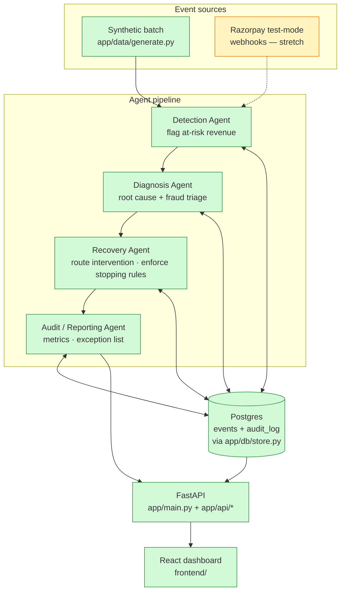
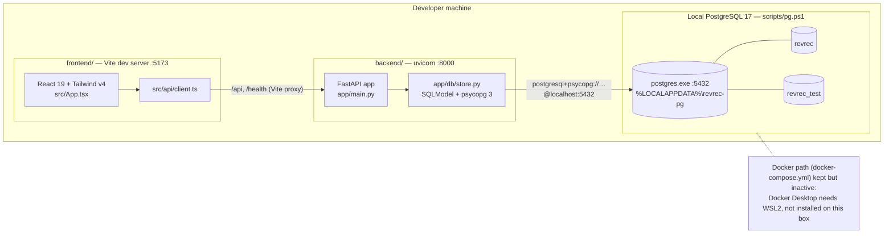
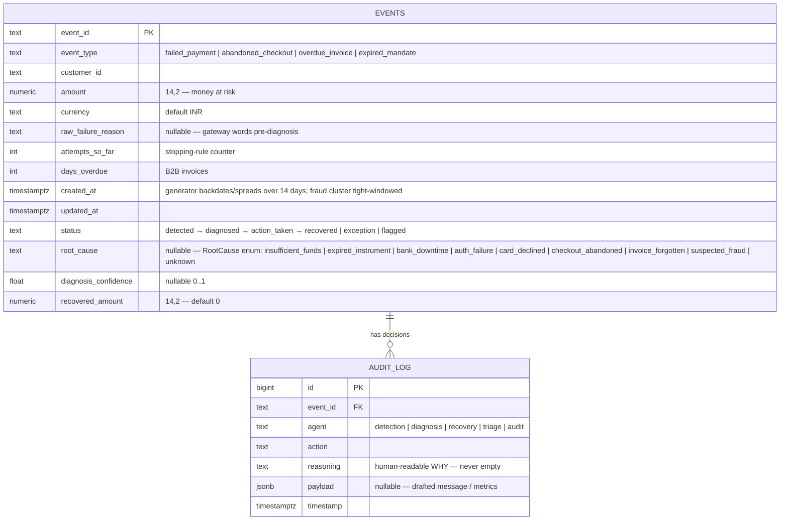
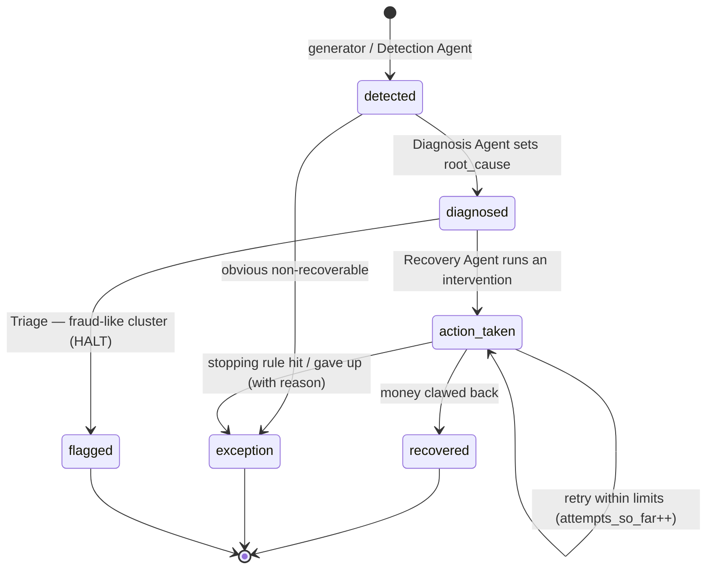
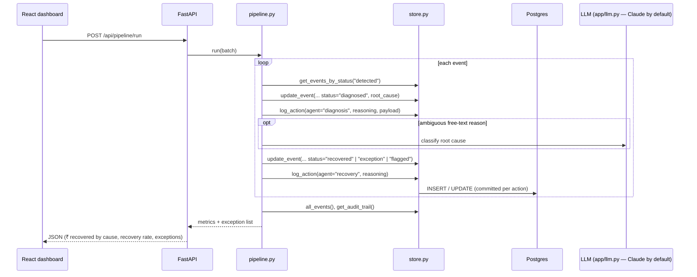

# Architecture — AI Revenue Recovery

Diagrams and design rationale. Companion to
[documentation.md](documentation.md) (exhaustive file/function reference) and
[CLAUDE.md](CLAUDE.md) (project brief).

> **Keep this current.** CLAUDE.md Section 13 requires this file to be updated in
> the same change that alters the architecture, data model, agent flow, or
> runtime topology.

Last updated: 2026-09-04 — provider-agnostic LLM client (`app/llm.py`: Anthropic
/ OpenRouter / OpenAI, auto-detected). Prior: 2026-09-04 — Phase B + C of the
agent-team build (plan.md §9 steps 3–8): all four agents built + merged,
`app/pipeline.py` chains them, `app/api/*` routers mounted in `main.py`, React
dashboard built, pipeline nodes recoloured `done`. Prior: 2026-09-03 — Phase A
(RootCause vocabulary, cross-agent + API contract frozen). Prior: 2026-08-28 —
step 2 (synthetic data generator); datastore switched from Docker to a local
PostgreSQL process.

---

## 1. One-paragraph summary

Synthetic (and later, real Razorpay test-mode webhook) events flow through four
sequential agents — **Detection → Diagnosis → Recovery → Audit** — that all read
and write one shared Postgres store via `app/db/store.py`. Every money-related
decision is written to the `audit_log` table *as it happens*; that table **is**
the audit trail. Recovery is root-cause-differentiated and bounded by explicit
stopping rules; a fraud-like cluster is deliberately re-classified as `flagged`
and left alone. A FastAPI backend exposes the store and the pipeline over REST;
a React dashboard renders the at-risk queue, per-case decision trails, recovery
metrics, and an honest exception list.

---

## 2. Agent pipeline

Green = built. Amber = not yet built (only the stretch Razorpay webhook
listener remains). `app/pipeline.py` chains DET→DIA→REC→AUD; `app/api/*`
exposes the store + pipeline over REST; the React dashboard renders it.

---

## 3. Runtime topology

---

## 4. Data model

---

## 5. Event lifecycle

`recovered` / `exception` / `flagged` are terminal. `exception` = honest
"couldn't recover, here's why"; `flagged` = deliberately stopped (suspected
abuse), never retried.

---

## 6. Request / data flow (target, once API + agents exist)

---

## 7. Component responsibilities

| Component | File(s) | Responsibility | Must guarantee |
|---|---|---|---|
| Event store | `app/db/store.py` | single interface to Postgres; table + schema models; CRUD + audit | no raw SQL elsewhere; `log_action` is the only audit write; FK-checked; validated input |
| Synthetic generator | `app/data/generate.py` | deterministic 50–100 event batch + fraud cluster; real Razorpay failure codes | reproducible per seed; every record schema-valid; fraud cluster has a detectable shared signature |
| Detection Agent | `app/agents/detection.py` ✅ | flag genuinely at-risk events; route obvious non-recoverables to `exception` | one audit row per decision; idempotent |
| Diagnosis Agent | `app/agents/diagnosis.py` ✅ | rules-first root-cause classification; Claude fallback for free-text; **fraud-cluster triage → `flagged`** | confidence recorded; triage reasoning explicit; Claude isolated + offline-safe |
| Recovery Agent | `app/agents/recovery.py` ✅ | root-cause-specific intervention; draft outreach; **enforce stopping rules** (max attempts, max escalation, cooldown, amount gate) | bounded; never reads `flagged`; human-approval flag above ₹5,000 (logged, not executed); deterministic outcome |
| Audit / Reporting | `app/agents/audit.py` ✅ | `compute_metrics` rolls `audit_log` + `events` into the MetricsBlock; `run` writes one `batch_metrics` row | computed over the full batch; exception list complete, never hidden |
| Pipeline | `app/pipeline.py` ✅ | chains agents 3–6 into one run; returns the MetricsBlock | argparse CLI + printed summary |
| API | `app/main.py`, `app/api/*` ✅ | REST over store + pipeline (`/api/events`, `/api/events/{id}/audit`, `/api/metrics`, `/api/pipeline/run`) | CORS to frontend only |
| Dashboard | `frontend/src/pages/*` ✅ (fixtures; live via `VITE_DATA_SOURCE`) | at-risk queue, decision trail, charts, exception list, fraud-cluster alert | mirrors Razorpay's plain-English tone |
| Webhook listener | `app/webhooks/listener.py` (stretch) | ingest Razorpay test-mode events into Detection | signature-verified |

---

## 8. Key design decisions

| Decision | Choice | Why |
|---|---|---|
| Datastore | PostgreSQL 17, local process via `scripts/pg.ps1` (zonky embedded binaries) | owner preference for Postgres; real types (`NUMERIC`, `TIMESTAMPTZ`, `JSONB`); FK always on. Docker was the plan but needs WSL2 (absent on Win 11 Home); `winget`/EDB install 403'd — so a self-contained binary install, no admin |
| ORM / validation | SQLModel (SQLAlchemy 2 + Pydantic) | one model stack for tables *and* API request/response shapes |
| Validation split | thin table models + `*Create` / `*Update` / `*Read` schema models | `table=True` disables Pydantic validation; schema models restore it (`extra="forbid"`, bounds, `field_validator`s) and double as API contracts |
| Money type | `Decimal` / `NUMERIC(14,2)`, quantised to paise | no float rounding drift in financial figures |
| Audit trail | `audit_log` table, written via `log_action` only, `reasoning` NOT NULL | "the bar" demands explainable + auditable; make silent actions impossible |
| Backend deps | `uv` + `pyproject.toml` + committed `uv.lock` | fast, reproducible, no `requirements.txt` |
| App shape | FastAPI backend + React/Vite/Tailwind frontend monorepo | owner chose a real API + JS UI over the brief's single Streamlit app |
| Determinism | generator seeded (`random.Random(seed)` + `Faker.seed_instance`) | repeatable demo & tests; fraud cluster reproducible. `created_at` is spread relative to build-time "now" (wall-clock, not seed-fixed) so the batch always looks recent; ids/amounts/types stay seed-deterministic |
| Event time axis | optional `EventCreate.created_at`; generator backdates the batch over 14 days, fraud cluster inside one 40-min window | the Diagnosis fraud-cluster check's "tight time clustering" clause needs a real time axis; a single-pass insert would make every `created_at` identical |
| Failure codes | real Razorpay error codes from `razorpay.com/docs/errors` | judged by Razorpay engineers — data must mirror their real system |
| Fraud handling | re-classify to `flagged`, Recovery refuses to act | the brief's required "one failure handled gracefully" moment |
| Parallel build isolation | each backend builder ran its tests against a dedicated DB (`revrec_test_diag` / `_rec` / `_aud`); merge + CI use `revrec_test` | five agents built in parallel without the per-test `reset_db` stomping each other |
| Audit entry points | `compute_metrics(session) -> dict` (pure, returned by pipeline + API) split from `run() -> list[str]` (writes the `batch_metrics` row) | keeps the uniform agent `run` signature while letting callers get the metrics without a write |
| Dashboard glass | `GlassCard` = frosted `backdrop-blur`, not the full liquid-glass refraction lib | meaning never rides on the effect; the lib can be layered in later with no API change |
| LLM provider | one `app/llm.py` client, provider auto-detected (`anthropic → openrouter → openai`); OpenRouter default model is still Claude | use whichever key is available without losing the "built on Claude" framing; both agent call-sites stay tiny and offline-safe |
| Root-cause vocabulary | `RootCause` `StrEnum` in `store.py` (9 members), one Recovery intervention each | keeps Diagnosis output and Recovery routing in lockstep; DB column stays `str \| None` (no migration), enum enforced at the schema layer (`EventUpdate`) |
| Cross-agent coupling | frozen `AGENTS_CONTRACT.md` (I/O table, `action` registry, stopping-rule constants, fraud signature, `payload` shapes) | agents are sequential at runtime but independent at build time — a contract lets the four modules be built in parallel by separate agents |
| Recovery outcome | deterministic per `hash(event_id)` vs a per-intervention success rate | stable, repeatable demo + tests; no RNG in the pipeline |
| Failure codes | corrected to real Razorpay test-mode strings (`insufficient_fund`, `authentication_failed`, `payment_timed_out`, `card_number_invalid`) verified 2026-09-03 | judged by Razorpay engineers; earlier codes (`insufficient_funds`, `incorrect_otp`) were near-misses |

---

## 9. Tech stack

| Layer | Tech |
|---|---|
| Language (backend) | Python 3.11 |
| Web framework | FastAPI + uvicorn |
| ORM / models | SQLModel · SQLAlchemy 2 · Pydantic 2 · pydantic-settings |
| DB driver | psycopg 3 (`postgresql+psycopg://`) |
| Database | PostgreSQL 17 — local process (`scripts/pg.ps1`); `docker-compose.yml` kept for Docker-capable machines |
| Data / synthetic | pandas · Faker |
| LLM | Provider-agnostic via `app/llm.py` — Anthropic (SDK), OpenRouter or OpenAI (OpenAI-compatible REST over `httpx`); auto-detected, Diagnosis fallback + Recovery outreach, all optional |
| Payments | `razorpay` SDK — **test mode only**, later |
| Backend tooling | uv · pytest · httpx |
| Frontend | React 19 · Vite · TypeScript · Tailwind CSS v4 · Recharts |
| Frontend tooling | npm · oxlint |
